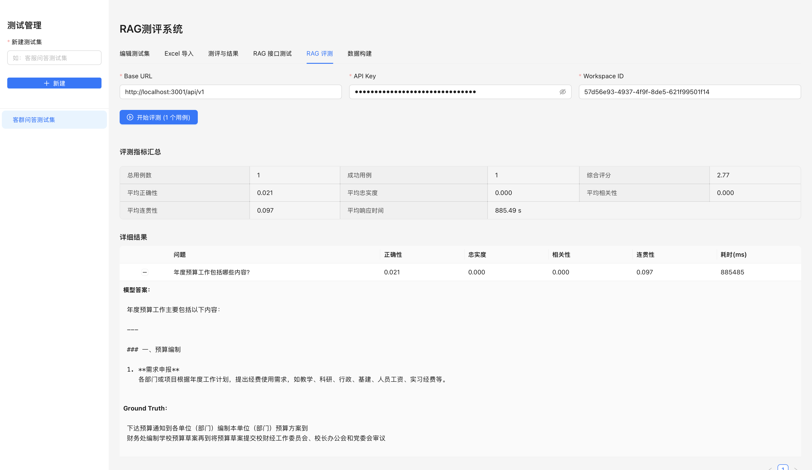

# RAG评估系统

一个全面的RAG（检索增强生成）系统评估平台，支持多维度的评测指标、自动化数据构建、以及完整的评测工作流。

## 📸 系统界面展示

### RAG评测界面


系统提供了直观的评测界面，展示了：
- **评测指标统计** - 实时显示正确性、忠实度、相关性、连贯性等指标
- **详细结果** - 展示每个测试用例的模型答案和Ground Truth对比
- **源文档追踪** - 显示RAG系统检索到的源文档信息
- **Ground Truth标注** - 支持查看和管理Ground Truth Chunks

📖 **详细界面说明** - 查看 [系统界面指南](docs/INTERFACE_GUIDE.md)

## 📋 项目概述

RAG评估系统是为了解决大模型应用中RAG系统质量评估的问题而开发的。它提供了从数据构建、测试用例管理、到评测执行的完整工作流，帮助开发者快速评估和优化RAG系统的性能。

### 核心特性

- ✅ **多维度评测指标** - 生成层、检索层、端到端指标
- ✅ **自动化数据构建** - Synthetic/Real/Adversarial三种数据生成策略
- ✅ **灵活的测试用例管理** - 支持手动创建、Excel导入、自动生成
- ✅ **Ground Truth标注** - 支持关联Ground Truth Chunks
- ✅ **实时评测执行** - 支持大模型和Embedding模型的集成
- ✅ **详细的结果分析** - 可视化展示评测结果和指标分布

## 🏗️ 项目架构

```
RAG评估系统
├── 前端 (React + TypeScript + Ant Design)
│   ├── 测试集管理
│   ├── 测试用例编辑
│   ├── RAG接口测试
│   ├── 评测执行与结果分析
│   └── 数据构建模块
├── 后端 (Spring Boot + MySQL)
│   ├── 数据管理服务
│   ├── RAG评测服务
│   ├── 数据构建服务
│   ├── 向量数据处理
│   └── 大模型集成
├── Embedding服务 (Python + FastAPI)
│   └── 文本向量化
└── 数据库 (MySQL)
    ├── 测试集表
    ├── 测试用例表
    ├── 评测结果表
    └── 评测任务表
```

## 🚀 快速开始

### 前置要求

- Java 17+
- Node.js 16+
- MySQL 8.0+
- Python 3.11+（可选，用于Embedding服务）

### 安装步骤

#### 1. 后端启动

```bash
cd backend

# 设置环境变量
export DB_USER=root
export DB_PASSWORD=password
export DB_NAME=rag_eval

# 启动Spring Boot应用
./mvnw spring-boot:run
```

后端服务将在 `http://localhost:8080` 启动

#### 2. 前端启动

```bash
cd frontend

# 安装依赖
npm install

# 启动开发服务器
npm run dev
```

前端应用将在 `http://localhost:5173` 启动

#### 3. Embedding服务启动（可选）

```bash
cd embedding-server

# 创建虚拟环境
python -m venv .venv
source .venv/bin/activate

# 安装依赖
pip install -r requirements.txt

# 启动服务
python server.py
```

Embedding服务将在 `http://localhost:8000` 启动

## 📊 主要测评指标

### 生成层指标（Generation Metrics）

#### 1. 答案正确性（Answer Correctness）
- **公式**：关键词重叠度 × 0.7 + 长度相似度 × 0.3
- **范围**：0-1
- **含义**：模型答案与真实答案的相似度

#### 2. 忠实度（Faithfulness）
- **公式**：答案中来自源文档的词数 / 答案总词数
- **范围**：0-1
- **含义**：答案是否基于检索到的源文档

#### 3. 相关性（Relevance）
- **公式**：答案中包含的问题关键词数 / 问题总词数
- **范围**：0-1
- **含义**：答案是否回答了用户的问题

#### 4. 连贯性（Coherence）
- **公式**：句子数量评分 × 0.5 + 平均句子长度评分 × 0.5
- **范围**：0-1
- **含义**：答案的逻辑清晰度和结构合理性

### 检索层指标（Retrieval Metrics）

#### 5. Hit Rate@k
- **公式**：在前k个结果中找到相关文档 ? 1 : 0
- **范围**：0-1
- **含义**：相关文档是否出现在前k个检索结果中

#### 6. MRR（Mean Reciprocal Rank）
- **公式**：1 / (第一个相关文档的排名位置)
- **范围**：0-1
- **含义**：第一个相关文档出现的位置

#### 7. Precision@k
- **公式**：前k个结果中的相关文档数 / k
- **范围**：0-1
- **含义**：检索结果的精准度

#### 8. Recall@k
- **公式**：前k个结果中的相关文档数 / 总相关文档数
- **范围**：0-1
- **含义**：检索的召回率

### 端到端指标（End-to-End Metrics）

#### 9. 综合评分（Overall Score）
- **公式**：(正确性 × 0.4 + 忠实度 × 0.2 + 相关性 × 0.2 + 连贯性 × 0.2) × 100
- **范围**：0-100
- **含义**：RAG系统的整体质量评分

#### 10. 响应时间（Response Time）
- **单位**：毫秒（ms）
- **含义**：系统的性能指标

## 💡 功能亮点

### 1. 智能数据构建

系统支持三种数据生成策略，自动构建高质量的评测数据集：

- **Synthetic Queries (40%)** - 基于文档内容用LLM生成问题
- **Real Queries (40%)** - 从真实用户查询中采样
- **Adversarial Queries (20%)** - 生成对抗样本测试鲁棒性

```
数据构建流程：
1. 输入文档内容
2. 自动生成多种类型的问题
3. 标注Ground Truth文档
4. 评估难度等级
5. 分类问题类型
```

**界面展示**：
- 支持多行文档输入
- 实时显示数据构建进度
- 可视化展示难度、类型、来源分布
- 预览生成的数据样本

### 2. Ground Truth Chunk管理

支持为每个测试用例关联多个Ground Truth Chunks，用于精确评估检索层性能：

- 从向量数据中加载Chunks
- 支持多选Ground Truth Chunks
- 自动展示Chunk的ID和文本内容
- 在评测结果中显示检索到的源文档

**功能特点**：
- 点击展开查看完整的问题、参考答案和Ground Truth Chunks
- 每个Chunk显示唯一ID和完整文本内容
- 支持鼠标悬停查看完整信息

### 3. 灵活的测试用例管理

- **手动创建** - 逐个创建测试用例
- **Excel导入** - 批量导入测试用例
- **自动生成** - 基于文档自动生成测试用例
- **删除操作** - 支持删除不需要的用例

### 4. RAG接口集成

支持与多种RAG系统集成：

- **AnythingLLM** - 完整的工作流集成
- **自定义RAG系统** - 通过API接口集成
- **向量数据支持** - 支持LanceDB、Milvus等向量数据库

**源文档展示**：
- 表格显示所有检索到的源文档
- 显示文档ID、标题、相关性分数
- 点击展开查看完整文本内容
- 支持多个源文档的对比分析

### 5. 重试机制

系统实现了带指数退避的重试机制，提高了评测的稳定性：

- 最多重试3次
- 第1次失败等待1秒
- 第2次失败等待2秒
- 第3次失败等待4秒

### 6. 详细的结果分析

- **指标分布** - 可视化展示各项指标的分布
- **难度分析** - 按难度等级分析评测结果
- **类型分析** - 按问题类型分析评测结果
- **来源追踪** - 追踪数据的来源（Synthetic/Real/Adversarial）

**评测结果展示**：
- 实时显示评测进度
- 详细的指标统计（正确性、忠实度、相关性、连贯性）
- 每个用例的详细结果对比
- 综合评分和性能指标

## 📖 使用指南

### 场景1：创建和管理测试集

1. 在左侧菜单中点击"新建"按钮
2. 输入测试集名称
3. 选择创建的测试集
4. 在"编辑测试集"Tab中添加测试用例

### 场景2：添加测试用例

#### 方式1：手动创建
1. 加载向量数据（可选）
2. 输入问题和参考答案
3. 选择Ground Truth Chunks（可选）
4. 点击"新增用例"

#### 方式2：Excel导入
1. 切换到"Excel导入"Tab
2. 上传包含问题和参考答案的Excel文件
3. 预览导入数据
4. 点击"确认导入"

#### 方式3：自动生成
1. 切换到"数据构建"Tab
2. 输入文档内容
3. 设置目标数据集大小
4. 点击"构建数据集"

### 场景3：执行RAG评测

1. 切换到"RAG评测"Tab
2. 配置RAG系统参数（Base URL、API Key等）
3. 点击"开始评测"
4. 等待评测完成
5. 查看详细的评测结果和指标分析

### 场景4：测试RAG接口

1. 切换到"RAG接口测试"Tab
2. 配置RAG系统参数
3. 输入测试问题
4. 点击"测试RAG"
5. 查看RAG系统的回答和引用来源

## 🔧 配置说明

### 后端配置

编辑 `backend/src/main/resources/application.properties`：

```properties
# 数据库配置
spring.datasource.url=jdbc:mysql://localhost:3306/rag_eval
spring.datasource.username=root
spring.datasource.password=password

# 服务器配置
server.port=8080

# Flyway数据库迁移
spring.flyway.enabled=true
spring.flyway.locations=classpath:db/migration
```

### 前端配置

编辑 `frontend/vite.config.ts`：

```typescript
export default defineConfig({
  server: {
    proxy: {
      '/api': {
        target: 'http://localhost:8080',
        changeOrigin: true,
      },
    },
  },
})
```

### RAG系统配置

在前端界面中配置：

- **Base URL** - RAG系统的API地址
- **API Key** - RAG系统的认证密钥
- **Workspace ID** - RAG系统的工作空间ID

## 📁 项目结构详解

### 后端结构

```
backend/src/main/java/com/talon/rageval/
├── controller/          # API控制器
│   ├── DatasetController.java           # 测试集管理
│   ├── TestCaseController.java          # 测试用例管理
│   ├── RagEvaluationController.java     # RAG评测
│   ├── RagTestController.java           # RAG接口测试
│   ├── DatasetBuilderController.java    # 数据构建
│   └── ...
├── service/             # 业务逻辑
│   ├── rag/
│   │   ├── RagEvaluator.java            # 评测指标计算
│   │   ├── RagEvaluationService.java    # 评测服务
│   │   ├── EvaluationDatasetBuilder.java # 数据构建
│   │   ├── AnyllmWorkspaceClient.java   # RAG系统集成
│   │   └── ...
│   ├── EvalJobService.java              # 评测任务管理
│   └── ...
├── entity/              # 数据实体
├── repository/          # 数据访问层
├── dto/                 # 数据传输对象
└── config/              # 配置类
```

### 前端结构

```
frontend/src/
├── App.tsx              # 主应用组件
├── App.css              # 样式文件
├── main.tsx             # 入口文件
└── assets/              # 静态资源
```

## 🔌 API接口

### 测试集管理

- `POST /api/datasets` - 创建测试集
- `GET /api/datasets` - 获取测试集列表
- `DELETE /api/datasets/{id}` - 删除测试集

### 测试用例管理

- `POST /api/datasets/{datasetId}/cases` - 创建测试用例
- `GET /api/datasets/{datasetId}/cases` - 获取测试用例列表
- `PUT /api/cases/{id}` - 更新测试用例
- `DELETE /api/cases/{id}` - 删除测试用例

### RAG评测

- `POST /api/rag-eval/run` - 执行RAG评测
- `POST /api/rag/test` - 测试RAG接口

### 数据构建

- `POST /api/dataset-builder/build` - 构建评测数据集
- `POST /api/dataset-builder/stats` - 获取数据集统计信息

### 向量数据

- `POST /api/rag-chunks/vector-data` - 加载向量数据

## 🐛 故障排除

### 问题1：后端启动失败

**症状**：`Connection refused` 或 `Cannot connect to database`

**解决方案**：
1. 确保MySQL服务正在运行
2. 检查数据库连接配置
3. 确保数据库 `rag_eval` 已创建

### 问题2：前端无法连接后端

**症状**：`Failed to fetch` 或 `CORS error`

**解决方案**：
1. 确保后端服务在 `http://localhost:8080` 运行
2. 检查前端代理配置
3. 清除浏览器缓存并硬刷新（Ctrl+Shift+R）

### 问题3：RAG评测超时

**症状**：`Read timed out` 错误

**解决方案**：
1. 确保RAG系统服务正在运行
2. 检查网络连接
3. 增加超时时间配置

### 问题4：向量数据加载失败

**症状**：`File not found` 或 `Invalid JSON format`

**解决方案**：
1. 检查文件路径是否正确
2. 确保JSON文件格式有效
3. 检查文件权限

## 📝 数据库架构

### 主要表结构

#### dataset（测试集表）
```sql
CREATE TABLE dataset (
  id BIGINT PRIMARY KEY AUTO_INCREMENT,
  name VARCHAR(255) NOT NULL,
  created_at TIMESTAMP DEFAULT CURRENT_TIMESTAMP
);
```

#### test_case（测试用例表）
```sql
CREATE TABLE test_case (
  id BIGINT PRIMARY KEY AUTO_INCREMENT,
  dataset_id BIGINT NOT NULL,
  question TEXT NOT NULL,
  reference_answer TEXT,
  ground_truth_chunk_ids JSON,
  created_at TIMESTAMP DEFAULT CURRENT_TIMESTAMP,
  FOREIGN KEY (dataset_id) REFERENCES dataset(id)
);
```

#### eval_job（评测任务表）
```sql
CREATE TABLE eval_job (
  id BIGINT PRIMARY KEY AUTO_INCREMENT,
  dataset_id BIGINT NOT NULL,
  status VARCHAR(50),
  created_at TIMESTAMP DEFAULT CURRENT_TIMESTAMP
);
```

#### eval_result（评测结果表）
```sql
CREATE TABLE eval_result (
  id BIGINT PRIMARY KEY AUTO_INCREMENT,
  job_id BIGINT NOT NULL,
  test_case_id BIGINT NOT NULL,
  correctness DOUBLE,
  faithfulness DOUBLE,
  relevance DOUBLE,
  coherence DOUBLE,
  created_at TIMESTAMP DEFAULT CURRENT_TIMESTAMP
);
```

## 🤝 贡献指南

欢迎提交Issue和Pull Request来改进这个项目！

## 📄 许可证

MIT License

## 📞 联系方式

如有问题或建议，请联系项目维护者。

---

**最后更新**：2026年3月15日
